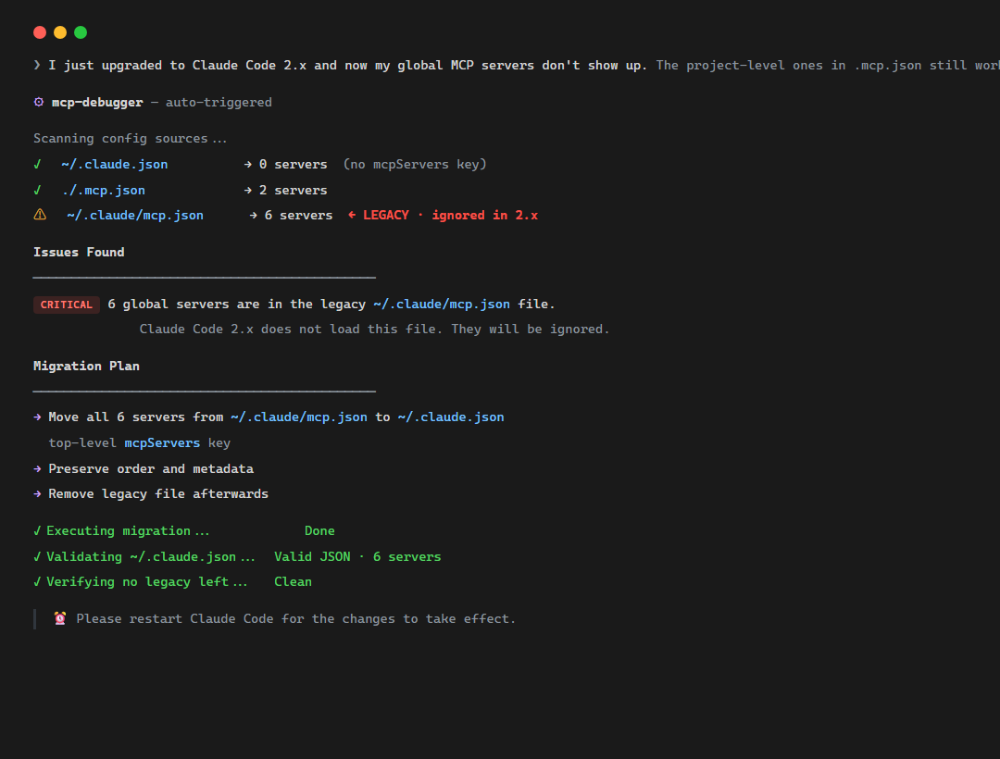

<div align="center">

# 🔧 MCP Debugger（调用mcp有问题？一个skill解决）

**Stop guessing. Diagnose and fix MCP server configuration issues in one pass.**

[](LICENSE)
[](https://github.com/HOBER-EST/mcp-debugger/stargazers)
[](https://github.com/HOBER-EST/mcp-debugger/fork)
[](https://github.com/HOBER-EST/mcp-debugger/commits/master)


**Diagnose · Fix · Verify** — A [Claude Code skill](https://docs.claude.com/en/docs/claude-code/skills) that catches every silent failure in your MCP setup.

[English](README.md) · [中文](README.zh-CN.md)

</div>

---

<p align="center">
  
</p>

## The Pain

You add an MCP server. Restart Claude Code. **It's not there.**

No error. No log. No clue. You Google for 20 minutes, find a Stack Overflow answer from four months ago that may or may not still apply to your Claude Code version. You try three things. Nothing works. You delete the whole config and start over.

Sound familiar?

**The problem isn't you. The problem is that MCP configuration silently fails in 8+ ways** — and every fix involves a different file, a different syntax, a different OS-specific quirk. The error message you wanted? There isn't one.

This skill turns that 30-minute yak-shave into a 30-second diagnosis.

---

## What It Does

`mcp-debugger` is a Claude Code skill that, when you describe an MCP issue, automatically:

1. 🔍 **Scans** every config source (`~/.claude.json`, `.mcp.json`) plus every legacy/stale location
2. 🔬 **Diagnoses** every known issue class — not just the first one
3. 🛠️ **Fixes** them in priority order with copy-paste commands
4. ✅ **Verifies** the corrected config with re-validation + smoke tests

| Symptom | Without this skill | With this skill |
|---------|-------------------|------------------|
| "Global MCP servers not showing" | 30 min googling → maybe migrate `~/.claude/mcp.json` | 30 sec → "Found 6 servers in legacy file. Migrating now." |
| "Server starts but no tools appear" | Reinstall the package and pray | "Package `foo-mcp` has no `@modelcontextprotocol/sdk` dep — not an MCP server" |
| "Everything broke after Claude Code 2.x" | Roll back, lose features | "Legacy `~/.claude/mcp.json` is now ignored. Auto-migrating to `~/.claude.json`." |
| "Works on Mac, fails on Windows" | Switch to Mac, sigh | "Missing `cmd /c` wrapper. Auto-fixing all `npx` invocations." |

---

## Quick Start

### Install

```bash
# Option 1 — Manual install
mkdir -p ~/.claude/skills/mcp-debugger
cp skill.md ~/.claude/skills/mcp-debugger/
cp -r evals examples ~/.claude/skills/mcp-debugger/
```

### Trigger

Just describe your MCP issue in plain language — the skill auto-triggers on any of:

- "MCP not showing"
- "MCP config"
- "MCP server won't start"
- "MCP tools missing"
- "My MCP servers disappeared"

Or invoke explicitly: `/mcp-debugger`

---

## What's Inside

### 10 Known Issue Classes (continuously growing)

| # | Issue | Severity |
|---|-------|----------|
| 1 | Global MCP in legacy `~/.claude/mcp.json` (silently ignored in 2.x) | 🔴 Critical |
| 2 | JSON syntax errors (kill ALL servers in that file) | 🔴 Critical |
| 3 | Missing `type` field (server silently dropped) | 🟡 Warning |
| 4 | Windows `npx` needs `cmd /c` wrapper | 🟡 Warning |
| 5 | Wrong npm package (named `xxx-mcp` but not actually an MCP server) | 🟡 Warning |
| 6 | Missing required env vars / API keys | 🟡 Warning |
| 7 | Project servers in `.mcp.json` not enabled | 🟡 Warning |
| 8 | Stale `mcpServers` in `settings.json` (after upgrading) | 🟡 Warning |
| 9 | Server starts but exits immediately (smoke test) | 🟠 Hidden |
| 10 | Same server name in both global and project (shadowing) | 🟡 Warning |

Full list with diagnostics and fixes → see [`skill.md`](skill.md).

---

## MCP Configuration Model (Claude Code 2.x)

The skill understands the actual loading order:

```
┌──────────────────────────────────────────────────────────────┐
│  Resolution Priority (Claude Code 2.x)                        │
├─────┬───────────────────────────────────────┬────────────────┤
│  1  │ CLI --mcp-config flag                 │ Single invoke  │
│  2  │ ./.mcp.json                           │ Project        │
│  3  │ ~/.claude.json → projects.<cwd>...    │ Local          │
│  4  │ ~/.claude.json → mcpServers           │ Global         │
│  5  │ ~/.claude/mcp.json                    │ ❌ LEGACY      │
└─────┴───────────────────────────────────────┴────────────────┘
```

⚠️ **The biggest trap:** `~/.claude/mcp.json` is **silently ignored in 2.x**, but no error is thrown. Servers in it appear "global" but never load. This is the #1 cause of "global MCP disappeared" pain.

---

## Symptoms → Diagnosis → Fix

| Symptom | Most Likely Cause | Fix |
|---------|------------------|-----|
| **Global MCP not showing (project works)** | Servers in legacy `~/.claude/mcp.json` | Migrate to `~/.claude.json` → `mcpServers`; delete legacy file |
| **No MCP servers appear at all** | JSON syntax error | Validate JSON; UTF-8 on Windows for `~/.claude.json` |
| **One server missing, others work** | Missing `type`, wrong package, or Windows needs `cmd /c` | Add `"type": "stdio"`; verify package; wrap npx |
| **Server in `.mcp.json` not loading** | Not enabled in `settings.local.json` | Set `enableAllProjectMcpServers: true` |
| **npx server fails on Windows** | Missing `cmd /c` wrapper | `"command": "cmd", "args": ["/c", "npx", ...]` |
| **Server exits immediately** | Missing env var or package crash | Check `env` keys; smoke-test manually |
| **Server loads but no tools** | Wrong package (not an MCP server) | `npm view <pkg> dependencies` — check for `@modelcontextprotocol/sdk` |
| **SSE server won't connect** | Server not running or wrong URL | `curl <url>`; ensure server is up before Claude |
| **All servers disappeared** | Stale `mcpServers: {}` in `settings.json` | Remove `mcpServers` from `settings.json` |

---

## Example

<p align="center">
  
</p>

```
👤 You: "I just upgraded to Claude Code 2.x and now my global MCP servers don't
        show up. Only the project ones in .mcp.json are visible."

🤖 Claude (with mcp-debugger):

   Scanning config sources...

   ✓ ~/.claude.json              → 0 servers (no mcpServers key)
   ✓ ./.mcp.json                 → 2 servers
   ⚠ ~/.claude/mcp.json          → 6 servers  ← LEGACY, ignored in 2.x

   Issues Found
   ─────────────────────────────────────────────
   🔴 CRITICAL  6 global servers are in the legacy ~/.claude/mcp.json file.
                 Claude Code 2.x does not load this file. They will be ignored.

   Migration Plan
   ─────────────────────────────────────────────
   → Move all 6 servers from ~/.claude/mcp.json to ~/.claude.json
     top-level mcpServers key
   → Preserve order and metadata
   → Remove legacy file afterwards

   Executing migration...         ✓ Done
   Validating ~/.claude.json...   ✓ Valid JSON, 6 servers
   Verifying no legacy left...    ✓ Clean

   ⏰ Please restart Claude Code for the changes to take effect.

👤 You: "🎉 they're all back. thanks."
```

---

## Project Structure

```
mcp-debugger/
├── skill.md                ← The skill definition (loaded by Claude Code)
├── evals/
│   └── evals.json          ← 10 real-world test cases
├── examples/
│   ├── README.md           ← Walk-through of before/after
│   ├── broken-mcp.json     ← Deliberately broken config (use to test)
│   └── fixed-mcp.json      ← Same config after the skill fixes it
├── assets/
│   ├── hero.svg            ← README banner
│   ├── demo.html           ← Source of the screenshot below
│   ├── demo.png            ← Rendered screenshot
│   └── capture-demo.ps1    ← Re-run to refresh the screenshot
├── README.md               ← You are here
├── README.zh-CN.md         ← 中文文档
├── LICENSE                 ← MIT
├── CONTRIBUTING.md         ← How to add a new failure pattern
└── CHANGELOG.md            ← Release history
```

---

## Contributing

We welcome bug reports, new MCP failure patterns, and platform-specific fixes.

- 🐛 **Add a new failure pattern** → open an issue with: trigger phrase + diagnostic + fix
- 🧪 **Add an eval case** → copy `evals/evals.json` schema, add your broken config
- 🔧 **Fix a bug** → fork + PR, please include the eval that covers your fix

See [CONTRIBUTING.md](CONTRIBUTING.md) for the full workflow.

---

## Roadmap

- [ ] Auto-detect SSE servers vs stdio from package metadata
- [ ] VS Code MCP server config support (`<workspace>/.vscode/mcp.json`)
- [ ] Cursor MCP config support (`~/.cursor/mcp.json`)
- [ ] "What changed in last upgrade" — config diff tool

---

## Acknowledgments

Built from real debugging pain. The patterns here are extracted from production Claude Code setups across macOS, Windows (incl. GBK encoding traps), and Linux. Thanks to everyone who shared their broken configs in issues.

---

## License

[MIT](LICENSE) — use it, modify it, distribute it. Attribution appreciated.

## 📈 Star History

If `mcp-debugger` saved you time, a ⭐️ goes a long way.

<a href="https://star-history.com/#HOBER-EST/mcp-debugger&Date">
  <picture>
    <source media="(prefers-color-scheme: dark)" srcset="https://api.star-history.com/svg?repos=HOBER-EST/mcp-debugger&type=Date&theme=dark" />
    <source media="(prefers-color-scheme: light)" srcset="https://api.star-history.com/svg?repos=HOBER-EST/mcp-debugger&type=Date" />
    
  </picture>
</a>
